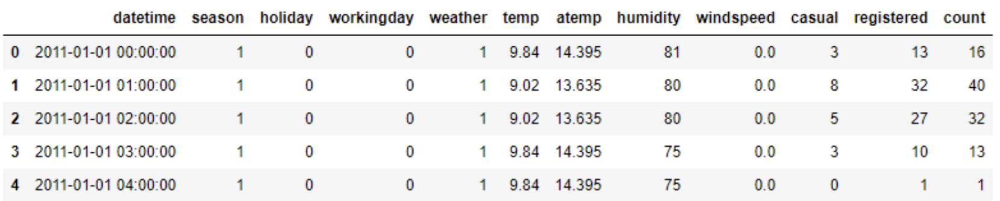
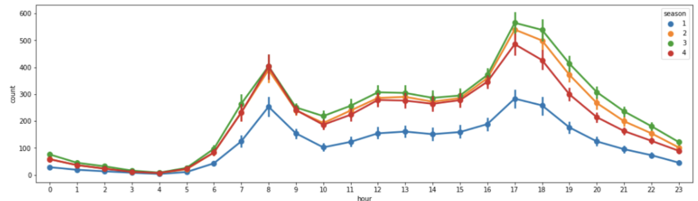
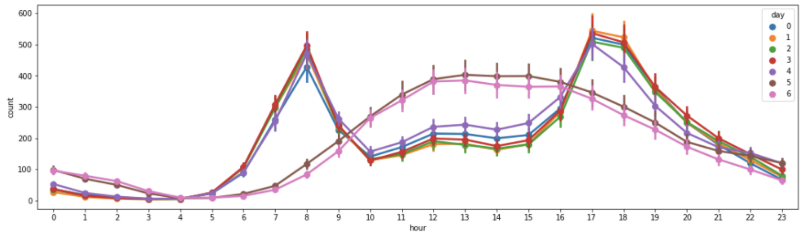
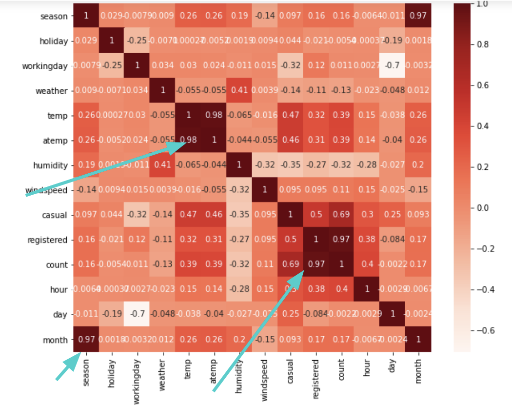

# 🚲 Bike Sharing - On-Demand Prediction

## 📌 Overview
This project focuses on predicting bike rental demand for the Capital Bikeshare program in Washington, D.C. by analyzing historical usage patterns and weather data.

 <!-- Replace with actual image path -->

## 🏆 Problem Statement
To forecast the demand for bike rentals by leveraging data science techniques, including exploratory data analysis, feature engineering, and machine learning models.

## 👨‍💻 Team Members
- **Om Jodhpurkar**
- **Sandesh Sachdev**
- **Aayush Chandak**
- **Hevesh Lakhwani**

## 🛠 Technology Stack
- **Python** 🐍 - Programming Language
- **AWS Sagemaker** ☁️ - Jupyter Notebook for model training
- **Amazon S3** 📂 - Cloud storage for datasets

---

## 🔍 Data Understanding

### 📌 Input Data Columns
| Column Name | Type | Description |
|-------------|------|-------------|
| `DATETIME` | Datetime | "yyyy/mm/dd hh:mm" format |
| `SEASON` | Integer | 1 = Spring, 2 = Summer, 3 = Fall, 4 = Winter |
| `HOLIDAY` | Integer | 1 = Holiday, 0 = Not a holiday |
| `WORKINGDAY` | Integer | 1 = Working day, 0 = Weekend/Holiday |
| `WEATHER` | Integer | 1 = Clear/Few Clouds, 2 = Mist/Cloudy, 3 = Light Snow/Rain, 4 = Heavy Rain |
| `TEMP` | Float | Hourly temperature (°C) |
| `ATEMP` | Float | "Feels like" temperature (°C) |
| `HUMIDITY` | Float | Relative humidity (%) |
| `WINDSPEED` | Float | Wind speed |

### 📌 Output Data Columns
| Column Name | Type | Description |
|-------------|------|-------------|
| `REGISTERED` | Integer | Number of registered users |
| `CASUAL` | Integer | Number of non-registered users |
| `COUNT` | Integer | Total rentals (`registered + casual`) |

📌 **Note:** Modeling was done separately for `casual` and `registered` values to predict the total count.

---

## 📊 Exploratory Data Analysis (EDA)
EDA techniques used in this project include:

- **Handling Missing Values** ❌
- **Removing Duplicates** 🗑️
- **Outlier Treatment** 📏
- **Data Normalization & Scaling** 📉
- **Encoding Categorical Variables** 🔠
- **Bivariate Analysis** 📈

### 📅 Extracting Date Components
To train the model effectively, the `DATETIME` column was broken down into:

| Feature | Type | Range |
|---------|------|-------|
| `HOUR` | Integer | 0-23 |
| `DAY` | Integer | 0-6 (Weekday representation) |
| `MONTH` | Integer | 1-12 |

---

## 📈 Data Visualization & Feature Engineering
### 🔥 Key Observations

- **Hourly Trends**: Peak rental hours differ for working vs. non-working days.
- **Seasonal Trends**: Fall (`Season 3`) has the highest rentals, while Spring (`Season 1`) has the least.
- **Temperature Relation**: Higher temperatures result in more bike rentals.
- **New Feature "PEAK"**: Created based on high-demand hours.

📊 Example Visualizations:
 <!-- Replace with actual image path -->
 <!-- Replace with actual image path -->

---

## 🎯 Feature Selection
**Why Feature Selection?**
- Reduces training time ⏳
- Reduces algorithm complexity ⚡
- Avoids misleading data ❌
- Minimizes redundancy 🔄
- Prevents overfitting 📉
- Improves model accuracy ✅

### 🔍 Feature Selection Techniques Used:
1. **Univariate Selection** 📊
2. **Feature Importance** 🌟
3. **Correlation Heatmap** 🔥

Example Correlation Heatmap:
 <!-- Replace with actual image path -->

#### 📌 Top Features
| **For Casual Count** | **For Registered Count** |
|----------------------|-------------------------|
| Hour ⏳ | Hour ⏳ |
| Humidity 💧 | Humidity 💧 |
| Temperature 🌡️ | Month 📅 |
| Working Day 🏢 | Working Day 🏢 |
| Peak 🚀 | Peak 🚀 |

---

## 🤖 Machine Learning Modeling
We explored various regression models, including:

- **Linear Regression** 📉
- **Decision Trees** 🌳
- **Random Forest** 🌲
- **Adaptive Boosting (AdaBoost)** 🔥
- **Gradient Boosting (GBM)** 📈
- **XGBoost** 🚀

### 📏 Evaluation Metric
We used **Root Mean Square Error (RMSE)** as our key evaluation metric.

---

## 🏗️ Model Training Pipeline
1️⃣ **Create**: Declare the model  
2️⃣ **Train**: Fit the model on the training data  
3️⃣ **Evaluate**: Measure performance using RMSE  
4️⃣ **Predict**: Generate predictions on the test data  

---

## 🔄 Cross-Validation
Cross-validation was used to evaluate model generalizability. The process included:
1. Shuffling the dataset randomly
2. Splitting it into `k` groups
3. Training on `k-1` groups and testing on the remaining group
4. Averaging the performance across all groups

---

## 🎯 Hyperparameter Tuning
We performed hyperparameter tuning using:
- **Grid Search** 🔍
- **Random Search** 🎲

### 🚀 Best Models & Results
| Model | RMSE (Before) | RMSE (After Tuning) |
|-------------|----------------|----------------|
| **XGBRegressor (Casual)** | 16.31 | 14.91 |
| **RandomForestRegressor (Casual)** | 16.73 | 15.92 |
| **XGBRegressor (Registered)** | 53.52 | 51.95 |
| **RandomForestRegressor (Registered)** | 57.06 | 54.27 |

---

## 📌 Conclusion
Our analysis successfully predicted bike rental demand with improved accuracy after feature selection, hyperparameter tuning, and model selection. XGBoost and RandomForestRegressor provided the best results.

---

